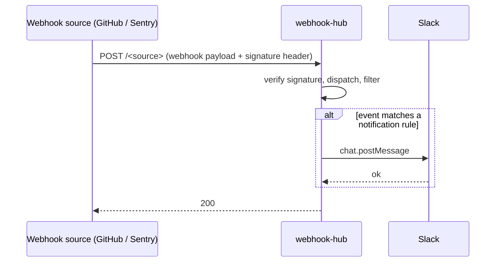

# Architecture

## Overview

webhook-hub is a single Hono HTTP service that receives webhooks from multiple sources (GitHub, Sentry), applies a small set of filters, and posts matching events to Slack.



## Request flow

Each registered `WebhookSource` (`src/webhook-source.ts`) is mounted at its own path and runs the same pipeline (`src/server.ts`):

1. `extractContext()` pulls the delivery ID and event/resource name from the request headers. Missing headers return `400`.
2. `verify()` checks the request's signature against the source's shared secret. Failure returns `401`.
3. The raw body is parsed as JSON. Parse failure returns `400`.
4. `dispatch()` runs the source-specific handler for the event.
5. If the handler returns a notification, the Slack client posts it; otherwise the request is recorded as `filtered` or `ignored`.
6. Successful processing returns `200` with `{ ok: true, outcome }`. Any thrown error inside dispatch/handler is logged and also returned as `200` with `{ ok: false, outcome: "error" }` — this is intentional, because the source will redeliver any non-2xx response and the failures here are not transient.

### GitHub (`POST /github`)

Headers: `x-github-delivery`, `x-github-event`, `x-hub-signature-256`. `@octokit/webhooks` verifies the HMAC-SHA256 signature against `GITHUB_WEBHOOK_SECRET`.

### Sentry (`POST /sentry`)

Headers: `Request-ID`, `Sentry-Hook-Resource`, `Sentry-Hook-Signature`. The signature is an HMAC-SHA256 of the raw body against `SENTRY_WEBHOOK_SECRET`, compared with `timingSafeEqual` (`src/sources/sentry/verify.ts`).

## Notification rules

### `workflow_run`

A Slack message is posted only when **all** of the following are true:

- `action === "completed"`
- `workflow_run.conclusion === "failure"`
- `workflow_run.head_branch === repository.default_branch`
- `workflow_run.head_repository.full_name === repository.full_name` — excludes runs originating from forks, whose `head_branch` can collide with the upstream default branch name.

The message is posted as a Slack attachment with a red border, containing Block Kit blocks:

1. **header** — `🚨 {workflow name} failed`
2. **section** (omitted for `schedule`/`workflow_dispatch`) — what changed, depending on the triggering event:

   | Trigger                      | Content                                                                                                                 |
   | ---------------------------- | ----------------------------------------------------------------------------------------------------------------------- |
   | `push`                       | `#{PR number} {PR title}` linked to the merged PR for that commit, or the commit message's first line if no PR is found |
   | `schedule`                   | omitted                                                                                                                 |
   | `workflow_dispatch`          | omitted                                                                                                                 |
   | other (e.g. `issue_comment`) | the run's `display_title`                                                                                               |

3. **section** (omitted if unavailable) — `失敗: \`{job name}\` › \`{step name}\`` for the first failed job/step
4. **context** — `{repo} · {trigger label} · <run url|View run>`, where the trigger label is omitted for `push`, `定期実行` for `schedule`, `` `@{actor}` が手動実行 `` for `workflow_dispatch`, and `` `{event}` 起因 `` for other triggers

The message is posted with a custom bot identity (username `GitHub CI`, GitHub Actions' avatar), requiring the `chat:write.customize` Slack scope.

The PR and failed-step lookups use the GitHub REST API via octo-sts; a lookup failure degrades gracefully — the notification still posts, just without that line.

### `pull_request`

Handled for `action === "opened"` and `action === "closed"`, when at least one of:

- the PR title ends with `[security]` (matched by `/\[security\]\s*$/`), or
- the head branch matches `/^renovate\/.*-vulnerability$/`.

The message tags the PR as a security PR, includes the title, and links to the PR page. A coloured attachment border encodes the lifecycle state:

| State                    | Border colour | Slack action                                   |
| ------------------------ | ------------- | ---------------------------------------------- |
| opened                   | green         | `chat.postMessage`                             |
| merged (closed + merged) | purple        | `chat.update` on the original `opened` message |
| closed without merging   | red           | `chat.update` on the original `opened` message |

The link back to the original message uses Slack message metadata (`event_type: "security_pr"`, `event_payload: { pr_url }`). On a `closed` event the handler scans recent `conversations.history` of `SLACK_CHANNEL` for a matching metadata payload and edits that message in place. If no matching message is found (e.g. the original is past the history window, or the bot was offline when the PR was opened), the close notification is posted as a new message instead.

For `action === "opened"` PRs that aren't security PRs, a third-party check runs instead (see below). All other events and actions short-circuit to `ignored`.

### Third-party `issues` / `pull_request`

A Slack message is posted to `SLACK_ACTIVITY_CHANNEL` (default `#github_activity`) when `action === "opened"` and the sender is neither a bot nor the repository owner:

- `sender.type !== "Bot"` — excludes GitHub Apps such as Renovate and Dependabot without needing a bot-name allowlist.
- `sender.login !== repository.owner.login` — excludes issues/PRs opened by the repository owner themselves.

The message links to the issue/PR and names its author; it carries no color or metadata, since there's no follow-up state to track. `pull_request` evaluates the security-PR check first — a third-party security PR is reported through that flow, not this one.

```
:speech_balloon: *New pull request opened on `fohte/example` by `octocat`*
*fix: support <T> generics*
<https://github.com/fohte/example/pull/2|View pull request>
```

(`issues` uses the same format with "issue" in place of "pull request".)

All other events and actions short-circuit to `ignored` or `filtered`.

### Sentry issue alerts

A Slack message is posted only when **both** of the following are true:

- `Sentry-Hook-Resource === "event_alert"`
- `payload.action === "triggered"`

The message includes the issue title, level, triggered rule, and a link to the issue page.

All other resources and actions short-circuit to `ignored`. No further filtering is applied on top of this — every verified, triggered issue alert is forwarded.
